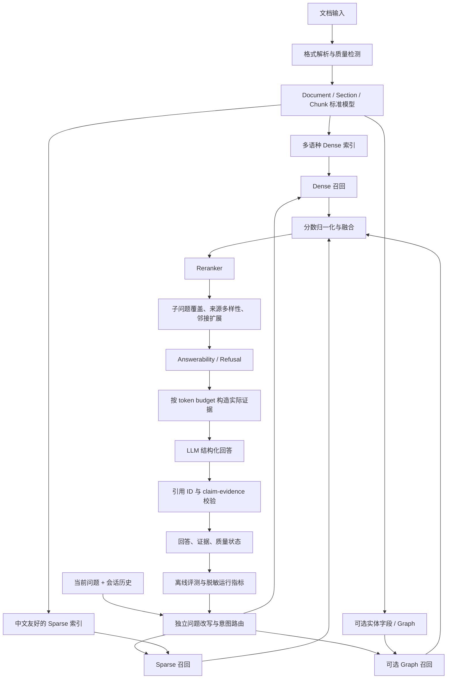

# Mneme RAG 工程与使用效果改进报告

> 评估日期：2026-08-01  
> 评估对象：当前工作区（包含 Docker/CLI 相关实现）  
> 评估方式：静态代码审计、离线测试、真实本地 embedding/Chroma 检索诊断  
> 目标读者：RAG、后端、LLM 应用与产品技术负责人

## 技术结论摘要

Mneme 已经超过“演示级 RAG”：它具备混合检索、查询拆解、Graph RAG、稳定 source/chunk identity、索引 manifest、引用编号、流式 TUI、文件监听、远程端点约束和提示注入边界。尤其是来源一致性、Graph 缓存版本绑定、按来源替换和安全上下文边界，说明项目已经建立了较好的可靠性底座。

当前主要瓶颈不在“有没有 RAG 功能”，而在“这些功能是否持续产生更好的答案”。代码和测试还无法证明中文检索、拒答、引用忠实度、Graph 增益和多轮问答已经达到可用质量。最优先的四项改进是：

1. **建立真正经过项目检索/生成链路的中英双语评测集。** 当前 3 条 smoke benchmark 不能作为质量门禁，部分真实检索测试即使 Recall 失败也不会失败。
2. **修复中文词法检索并重新评估 embedding。** 当前连续中文被当作一个 token；本地对照实验中，相关中文问题与三条中文文本的 BM25 分数全部为 0。
3. **统一候选分数、拒答门槛与有效上下文。** RRF 阈值几乎保证任意首位候选通过，而动态 Top-K 最终仍只向 LLM 发送前 5 个 chunk。
4. **把“要求模型引用”升级为“程序校验引用”。** 当前已有引用解析函数，但回答链路没有使用它；无引用、错引用或虚构引用不会触发修复或拒答。

建议先把 Standard RAG 做成可度量、可校准的可靠基线，再决定 Graph RAG 是否默认开放。Graph RAG 目前更适合作为实验能力，而不是已被证明优于 Standard RAG 的产品能力。

## 1. 当前系统能力与成熟度判断

下表中的“成熟度”是工程审计判断，不是线上用户满意度评分。

| 维度 | 当前判断 | 已确认的优点 | 主要缺口 |
| --- | --- | --- | --- |
| 文档摄取 | 可用原型 | PDF 保留页码；支持 PDF、DOCX、文本及多种扩展名 | 无 OCR、表格、版面和结构化元数据；部分格式只是按纯文本读取 |
| 索引一致性 | 较好 | source ID、内容哈希、配置指纹、manifest version、原子 sidecar、回滚 | 启动时不对“期望来源全集”做删除对账；大语料仍全量读入内存 |
| 混合检索 | 功能完整、质量未校准 | Chroma dense + BM25 + RRF + 多查询去重 | 中文 BM25 失效；无 reranker；无来源多样性与子问题覆盖约束 |
| 上下文构建 | 有安全边界 | 不可信文档标签、长度上限、页码和 chunk ID | 动态 Top-K 与固定前 5 个 chunk 冲突；按字符而非 token 预算 |
| 回答与引用 | 可展示、未闭环 | 提示词要求 `[S1]`；来源带页码和稳定 chunk ID | 不校验模型实际引用；没有 claim-evidence 检查和自动修复 |
| 拒答 | 已有入口、基本未标定 | 低分时可在调用 LLM 前拒答 | 阈值建立在 RRF 排名分而非相关性概率上，默认值几乎总会放行 |
| Graph RAG | 实验能力 | 缓存版本绑定、共现阈值、JSON 安全持久化 | 图分数与 RRF 不同量纲；实体匹配脆弱；无真实增益评测；全量重建成本高 |
| 多轮问答 | 生成侧可用 | 最近 5 轮历史会发送给 LLM | 检索只看当前原始问题，省略主语的追问容易召回错误 |
| 可观测性 | 初步可用 | 记录检索耗时、候选数、拒答数和 manifest version | 无端到端、TTFT、token、成本、分阶段耗时、引用有效率和质量指标 |
| 安全与隐私 | 基础较好 | HTTPS、路径/大小/页数限制、上下文上限、JSON 图缓存 | Graph 建图会把全部 chunk 分批发往远端；缺少集合级明确同意和敏感内容策略 |
| 测试与发布 | 单元回归较好 | 本地 139 个测试通过；依赖固定；Windows/Linux CI | 7 个外部服务测试默认跳过；质量 benchmark 不经过真实检索；CI 只测 Python 3.12 |

综合判断：**工程可靠性处于“可用原型后期”，效果工程处于“尚未建立可信基线”的阶段。**

## 2. 证据基线与指标定义

### 2.1 本次本地验证

| 验证项 | 结果 | 可说明什么 | 不能说明什么 |
| --- | ---: | --- | --- |
| `python -m pytest -q` | 139 passed，7 skipped，80.22s | 默认测试套件在本机通过 | 不能证明真实 LLM 回答质量；外部服务测试未运行 |
| `python -m pip check` | PASS | 当前 Python 环境依赖无破损 | 不能证明 Python 3.10/3.11 兼容性 |
| `python -m compileall -q src tui tests` | PASS | 源码可编译 | 不代表运行路径正确 |
| 论文 anchor Recall@20 | True | 当前单篇英文论文样例能召回首页 anchor | 不是答案正确率，也不是跨数据集泛化结果 |
| 论文 anchor 动态 Top-K | `k=22`，Recall=True | 当前融合排名没有丢掉目标 anchor | 实际上下文仍只使用前 5 个 chunk |
| 两条真实检索诊断 | 2 passed，22.73s | 本地 embedding + PDF + Chroma 链路能执行 | 测试没有把 Recall=False 设为失败条件 |
| 中文 BM25 对照 | 三条分数均为 0 | 当前 tokenizer 无法处理常见中文词级匹配 | 不代表 dense retrieval 也一定失败 |

本报告使用以下指标含义：

- **Recall@K**：标注相关 chunk/source/page 是否在前 K 个候选中。
- **Context Recall/Precision**：最终发给 LLM 的证据覆盖率与噪音比例；它与候选 Recall 不同。
- **Citation Precision/Recall**：回答中的引用是否支持对应事实，以及需要引用的事实是否都有引用。
- **Faithfulness**：回答事实能否由发送给模型的上下文推出。
- **Answerability/Refusal**：有依据问题被正确回答、无依据问题被正确拒答的能力。
- **端到端延迟**：检索、重排、首 token（TTFT）和完整回答的 p50/p95。

### 2.2 证据等级

- **A：代码确定**——可由当前实现直接确认。
- **B：本地观察**——来自本次 Windows/Python 3.12 运行。
- **C：效果推断**——高概率影响用户，但需要真实标注集或线上数据确认。

后文不会把 C 级推断表述成已经测得的线上结论。

## 3. 关键发现

### 3.1 P0：当前评测会给出“质量已过门禁”的假象

**结论（A/B）：测试覆盖了大量工程行为，但没有建立可信的 RAG 效果门禁。**

当前 benchmark 只有 3 个 corpus chunk、3 个查询，且 `k=3`；只要 retriever 返回全部 3 个 chunk，`Recall@3` 天然为 1。测试中的 retriever 还是单独实现的单词重合排序，没有调用 Mneme 的 embedding、Chroma、BM25、RRF 或 Graph 链路（`benchmarks/retrieval_quality.json`；`tests/test_phase_c_quality.py:18-34`）。

真实论文检索测试虽然会打印 Recall，但 Recall 为 False 时只打印警告，不执行断言（`tests/test_retrieval_fix.py:127-169`）。本次运行结果为 Recall@20=True、动态 Top-K Recall=True，说明该单一样例当前可工作，但它仍不是质量门禁。

默认 CI 还会跳过 7 个 `integration` 测试（`tests/conftest.py:31-45`），因此“139 passed”应解释为工程回归通过，而不是 RAG 效果通过。

**用户影响（C）：** embedding、分块、RRF、Graph 或 prompt 的改动可能让回答质量下降，但 CI 仍保持全绿；团队也无法判断某次优化究竟提升了哪些查询类型。

**建议：**

1. 建立 80-150 条最小真实评测集，覆盖中文、英文、中英混合、元数据、单文档事实、跨文档比较、多轮追问、无答案、表格和对抗文档。
2. 每条至少标注 `relevant_source_ids`、页码/section、可接受答案要点、是否应拒答；重要样例再标相关 chunk。
3. 评测必须调用实际 ingestion + retrieval；生成评测单独运行，避免把检索失败和生成失败混为一谈。
4. CI 分三层：快速纯单元测试、固定本地模型的离线检索集、定时/手动的完整生成评测。
5. 先记录基线，再设相对门禁；不要在没有真实分布时凭经验写一个“漂亮”的绝对分数。

### 3.2 P0：中文 BM25 基本不能提供预期的词法召回

**结论（A/B）：连续中文被正则表达式整体识别成一个 token，常见的局部词匹配无法发生。**

`_tokenize()` 将连续 CJK 字符作为一个整体（`src/rag.py:1090-1092`）。本次对照中：

```text
query: 作者属于什么学校
documents:
  这篇文章主要介绍人工智能的发展历史
  作者来自北京大学计算机学院
  学校位于北京
BM25 scores: [0.0, 0.0, 0.0]
```

这意味着“混合检索”对中文语料往往退化为 dense retrieval；BM25 只有在完整连续字符串恰好一致时才可能产生信号。与此同时，默认 `all-MiniLM-L6-v2` 没有在项目真实中文数据上做过基准验证（`src/rag.py:67-74`）。

分块也会放大问题：文本默认 2000 字符，分隔符包含英文句点但不包含 `。！？；` 等中文标点（`src/rag.py:153-170`）。

**用户影响（C）：** 中文专有名词、简称、数字、机构名和“关键词非常重要”的查询可能召回不稳定；界面是中文并不等于底层检索已经适配中文。

**建议：**

1. 先实现“英文/数字 token + 中文字符 bigram/trigram”基线；如果产品语料偏自然语言，再评测中文分词器。字符 n-gram 更容易保持可复现和低依赖。
2. 将文件名、标题、section、页码和结构化元数据作为独立可加权字段，不要只搜索 chunk 正文。
3. 在真实评测集上对比当前模型与至少一个多语种 embedding 候选。可选候选包括官方模型卡标明支持 100+ 语言、dense/sparse/multi-vector 的 [BAAI/bge-m3](https://huggingface.co/BAAI/bge-m3)，以及标明支持 100 种语言的 [intfloat/multilingual-e5-base](https://huggingface.co/intfloat/multilingual-e5-base)。模型更大并不自动更好，必须同时比较 CPU 延迟、内存和索引体积。
4. 把 embedding 模型、query/document 前缀、归一化方式和 tokenizer 配置全部纳入 manifest 指纹。

### 3.3 P0：拒答阈值没有衡量真实相关性

**结论（A）：默认阈值几乎只判断“有没有候选”，没有判断候选是否相关。**

RRF 使用 `1 / (rank + 30)`，rank 从 0 开始（`src/rag.py:1131-1153`）。因此：

- 任一单通道第一名：`1/30 = 0.0333`
- dense 与 BM25 都排第一：`2/30 = 0.0667`
- 默认拒答阈值：`0.03`（`src/rag.py:180-184,1375-1382`）

只要任一检索通道产生第一名，它就已经高于默认阈值，即使原始 cosine distance 和 BM25 分数都很差。当前实现还没有保留用于拒答的原始相关性特征。

这个问题会被候选生成方式进一步放大：BM25 结果不剔除 0 分文档，dense 检索也总会返回 collection 中相对最近的若干项；二者随后都按名次获得 RRF 分（`src/rag.py:1282-1324`）。因此除空 collection 外，系统很容易始终拥有一个“超过阈值”的候选。

Graph 模式更不平衡：当 `alpha=0.7` 时，第一名 graph chunk 的贡献可达 `0.3`，而 dense+BM25 RRF 的理论最高语义贡献约为 `0.7 × 0.0667 = 0.0467`（`src/graph_rag.py:494-503`）。名义上“语义占 70%”，数值上却可能由 graph 排名主导。

**用户影响（C）：** 无依据问题容易被送入 LLM，增加幻觉风险；Graph 的 alpha 设置不能直观表示真实融合权重。

**建议：**

1. 让每个候选保留 `dense_similarity`、`bm25_score`、各通道 rank、RRF、graph、rerank score。
2. 各通道只在同量纲或经过 query-level 归一化后融合；alpha 必须在固定评测集上做敏感性分析。
3. 拒答使用 reranker top score、top1-top2 margin、有效来源数和 query 类型等可解释特征；用有答案/无答案标注集选阈值。
4. 分开记录检索拒答、生成拒答、API 错误，不能把三者都当作普通回答文本。

### 3.4 P0：动态 Top-K 与实际发送的上下文不一致

**结论（A/B）：系统可以选择 20-70 个候选，但 `_build_context()` 和 `format_sources()` 都硬编码只使用前 5 个。**

`dynamic_top_k()` 会根据分数间隙选择 K（`src/rag.py:1156-1167`），流式 Standard RAG 默认允许 3-20，非流式路径默认 12-70。但 `_build_context()` 首行即执行 `top_indices[:5]`（`src/rag.py:1170-1186`），来源展示也执行 `indices[:5]`（`src/rag.py:1340-1347`）。

本次真实诊断中动态 K 为 22，但实际最多只有 5 个 chunk 进入上下文。运行指标仍把 `selected_count` 记为 22，并按 22 个候选统计来源数（`src/rag.py:1385-1406`），因此状态页也会高估有效证据量。

**用户影响（C）：** Top-K 设置对 5 之后的候选几乎没有回答效果；跨文档、多方面问题容易缺证据；状态页与真实 prompt 不一致。

**建议：**

1. 明确区分 `candidate_k`、`rerank_k`、`context_k`，并在指标中分别记录。
2. 用 token budget 构建上下文，不再使用固定 5 条和字符上限的组合。
3. 在重排后加入每来源上限、相邻 chunk 合并和子查询覆盖约束；跨文档问题优先覆盖不同来源。
4. 所有来源展示应来自“实际进入 prompt 的证据”，不是更大的候选集合。

### 3.5 P0：引用是提示要求，不是程序保证

**结论（A）：已有引用校验工具，但回答路径没有调用。**

系统提示要求事实使用 `[S1]` 等编号，上下文和来源列表也生成稳定编号（`src/rag.py:172-189,1192-1216,1340-1372`）。`src/citations.py:63-69` 能识别回答中的引用并找出非法 ID，但 `answer_query()`、`answer_query_stream()` 和 Graph 回答路径均未调用它。

当前系统不会处理以下情况：

- 回答没有任何引用；
- 回答引用不存在的 `[S99]`；
- 引用存在，但证据不支持对应事实；
- 模型输出 API 错误文本，同时 UI 仍展示检索来源。

**用户影响（C）：** 来源面板提高了可解释性外观，但用户仍需手工判断每个事实是否真的被来源支持。

**建议：**

1. 生成结束后强制校验引用 ID；非法 ID 触发一次受限修复，仍失败则明确标记回答不可验证。
2. 对需要事实依据的回答要求至少一个有效引用；纯对话/操作说明可按 query 类型豁免。
3. 评测 citation precision/recall，而不只验证编号格式。
4. 中期改为结构化 answer payload：`answer_markdown`、`claims[]`、`citation_ids[]`、`answerability`，TUI 只渲染通过 schema 校验的数据。

### 3.6 P1：Graph RAG 的“图”更接近实体共现扩展，且融合尚未校准

**结论（A）：Graph RAG 已有工程化缓存与降级能力，但其质量收益仍属假设。**

当前流程用 LLM 对每 5 个 chunk 提取自由文本实体，再根据实体在 chunk 中的共现建立无向边（`src/graph_rag.py:52-138,149-279`）。它没有关系类型、方向、实体类型或别名规范化，因此本质上是“LLM 实体 + 共现图”，不是结构化事实图谱。

主要问题包括：

- `list(set(entities))` 导致实体顺序不稳定，而前 20 个实体才参与建边，图在不同运行间可能不完全一致（`src/graph_rag.py:241-266`）。
- 只有存在边的实体进入 NetworkX 节点；稀疏图中的精确实体即使存在 `entity_to_chunks` 映射，也可能无法作为 seed 命中（`src/graph_rag.py:281-330`）。
- 查询实体只做 exact lowercase 匹配，没有别名、规范化和模糊匹配。
- 图关系权重用于选 related entities，但 `get_chunks_by_entities()` 最终只按命中实体数量计分，部分关系强度信息被丢弃。
- Graph 查询没有使用 Standard RAG 的查询拆解，多方面问题的行为不一致（`src/graph_rag.py:756-793` 对比 `src/rag.py:1648-1684`）。
- 添加或删除一个文件会全量重建图并再次调用远程 LLM；247 个 chunk 在 batch size=5 时约需 50 批实体抽取请求。

**用户影响（C）：** Graph 模式可能在专有名词和跨 chunk 关联上有帮助，也可能因实体漂移、图过稀或分数主导而降低准确率，并显著增加建库时间、费用和文档外发量。

**建议：**

1. 在同一评测集上固定比较 Standard、Standard+reranker、Graph 三组；Graph 只有在关键类别有显著净增益时才默认开放。
2. 先修复分数量纲，再调 alpha；不能直接对 RRF 与 `1/(rank+1)` 相加。
3. 实体抽取改为受 schema 约束的 JSON，至少包含 canonical name、type、aliases；排序和去重必须确定性。
4. exact entity 无边时直接回退 `entity_to_chunks`，避免稀疏图丢失精确命中。
5. 缓存实体抽取结果到 chunk ID + content hash，来源变更时只更新受影响 chunk；图合并可后置。
6. 如果核心需求只是跨片段实体召回，先比较“实体字段倒排索引 + reranker”，它可能比 NetworkX 图更简单、可控。

### 3.7 P1：解析和分块对文档结构的利用不足

**结论（A）：当前摄取链路保留了页码，但会丢失大量结构信号。**

- PDF 主要使用 `page.get_text("text")`，无 OCR、栏顺序校正、表格/图注提取和标题层级（`src/rag.py:236-285`）。
- DOCX 只读取段落，表格、页眉页脚等被忽略（`src/rag.py:288-294`）。
- HTML、JSON、CSV、XML、源码等都走 UTF-8 纯文本读取（`src/rag.py:192-201,297-318`）。
- 分块只按字符和通用分隔符，不知道标题、段落、表格、函数或 section（`src/rag.py:328-335`）。
- PDF 首页 anchor 是针对论文标题/作者问题的有效补丁，但命中后会在查询阶段重读源 PDF（`src/rag.py:1243-1270`），带来 I/O 和“索引旧内容、读取新文件”的一致性风险。

**用户影响（C）：** 表格问答、扫描 PDF、双栏论文、DOCX 表格、代码定位和长文档跨段事实容易失败；“支持某扩展名”不等于对该格式有高质量语义解析。

**建议：**

1. 引入统一 `Document -> Section -> Chunk` 数据模型，保存标题路径、页码、section type、字符/token 范围和解析器版本。
2. 实施 parent-child retrieval：小 chunk 负责召回，较大的 parent/邻接窗口负责回答。
3. PDF 首页正文应在索引阶段持久化，不要查询时重读；若必须重读，先校验 content hash。
4. 分格式建立质量等级：原生文本、结构化解析、OCR；TUI 在低质量解析时提示用户。
5. 优先支持真实使用最多的 2-3 种格式，不建议继续扩大“纯文本兼容”扩展名列表。

### 3.8 P1：多轮历史没有参与检索

**结论（A）：历史只进入生成消息，当前轮检索仍只使用原始 query。**

`_build_llm_messages()` 会附带最近 5 轮问答（`src/rag.py:1415-1427`），但 Standard 检索和 Graph 检索都只接收当前 query（`src/rag.py:1462-1511,1636-1695`；`src/graph_rag.py:756-785`）。

例如第一轮问“DSpark 论文讲了什么”，第二轮问“它的作者来自哪里”，LLM 在生成阶段知道“它”是谁，但检索阶段可能没有召回 DSpark 的作者信息。

**建议：**

1. 在检索前增加 history-aware standalone query rewrite，输出“独立可检索问题”。
2. 将“上下文消歧”和“多意图拆解”分成两个步骤，避免一个 prompt 同时承担代词解析、语言切分和查询扩展。
3. 对 rewrite 增加漂移防护：保留原 query 一路召回，并记录 rewrite 文本与结果覆盖差异。

### 3.9 P1：冷启动、全量操作和 LLM 网关会限制规模与体验

**结论（A/B）：当前适合小型本地语料，但随 chunk 数增长会出现明显的线性成本。**

主要证据：

- `LocalRagService` 先 `_ensure_model()`，随后 `prepare_index()` 又无条件加载一次模型（`tui/service.py:52-75`；`src/rag.py:843-861`），Standard TUI 冷启动存在重复加载。
- `_load_sentence_transformer()` 每次先尝试 Hugging Face/本地加载，失败后调用 ModelScope；本次两条真实检索诊断中，两次都出现 31 个文件的 ModelScope 下载/校验日志。
- Docker 镜像在构建期把模型下载到 `/app/models`，但 Compose 又把宿主机 `./models` bind mount 到同一路径；新宿主机上的空目录会遮蔽镜像内预下载模型，可能重新触发下载/校验（`Dockerfile:16-23,45-57`；`docker-compose.yml:10-13`）。
- 每次加载已有 collection 都会读取全部 documents/metadatas 并构建内存 BM25（`src/rag.py:866-878`）。持久化 snapshot 复用了 tokenization，但 `rank_bm25` 仍需全量语料常驻内存。
- 新增、删除 Graph 来源会对全部 chunk 重新提取实体（`tui/service.py:162-228`）。
- 查询拆解有 30 秒 timeout，但普通回答和 Graph 实体抽取没有统一 timeout、重试、取消和 token/费用限制（`src/rag_query_decomposer.py:68-89`；`src/rag.py:1430-1460,1601-1633`；`src/graph_rag.py:66-138`）。
- 几乎所有超过 4 个中文字符的 Standard 查询都会先调用一次 LLM 拆解，即使最终只返回原查询（`src/rag_query_decomposer.py:37-58`）。

**用户影响（C）：** 首次启动和首次索引等待较长；大 collection 的启动、增删文件和 Graph 更新成本快速增长；网络异常时 TUI 可能长时间停在 thinking 状态。

**建议：**

1. 服务实例只持有一个 embedding model；`prepare_index()` 接受已加载 model 或使用进程级线程安全缓存。
2. 将 model ID、本地路径、cache dir 和下载策略集中到 Settings；离线模式不能隐式触发远程 ModelScope。
3. 封装统一 LLM gateway：连接池、timeout、有限重试、退避、取消、并发上限、错误分类和 token 使用统计。
4. 查询拆解先用确定性规则判断是否为复合问题；简单问题直接检索。对拆解带来的 Recall 增益和额外延迟分别计量。
5. 超过预设 chunk 规模后迁移到持久化全文索引，或按 collection/source 分片，避免 Python 内存 BM25 成为上限。

### 3.10 P1：来源生命周期仍有一个“集合对账”缺口

**结论（A）：单个来源的修改/删除已经可靠，但启动时不会删除“不再出现在输入列表中的旧来源”。**

`_ensure_client_and_check_rebuild()` 只检查传入文件是否需要同步（`src/rag.py:806-834`）。`build_index()` 会替换发生变化的来源，但除 `force_rebuild` 或显式 `remove_file_from_index()` 外，不会把 manifest 中多余的来源删除（`src/rag.py:958-1018,1706-1743`）。

这对 TUI “按 collection 长期复用”可以是预期语义，但对 CLI “这次 `--files` 就是完整期望集合”的用户并不直观。

**建议：**

1. 明确两种 API：`sync_sources(desired_set)` 与 `add_sources(delta)`。
2. CLI `--files` 默认采用 desired-set 还是增量语义必须文档化；删除前展示差异并要求显式 `--sync` 或 `--prune`。
3. manifest 记录最近同步模式和时间，状态页展示 indexed sources 与当前选择的差异。

### 3.11 P2：配置、可观测性和模块边界不一致

**结论（A）：原型演进留下了多套默认值和过大的核心模块。**

- README 声明 temperature=0.2、Top-K=12-70；`.env.example` 与 TUI 默认却是 0.1、3-20（`README.zh.md:191-194`；`.env.example:10-17`；`tui/app.py:20-30`）。CLI 与 TUI 的效果因此不同。
- `RAG_REFUSAL_THRESHOLD` 可配置但没有出现在配置文档。
- `src/rag.py` 1743 行，承担配置、下载、解析、分块、索引事务、BM25、融合、上下文、LLM 与 CLI；`src/graph_rag.py` 793 行。
- 指标只在内存中保存最近 100 条，记录 retrieval 时间和计数；没有索引耗时、embedding、query rewrite、各检索通道、rerank、TTFT、总耗时、token、成本和引用有效率（`src/metrics.py:15-64`）。
- 文件监听回调会静默吞掉异常（`tui/service.py:379-389`），用户难以发现某文件没有入库。
- Chroma 数据固定写入 `src/chroma_db`（`src/rag.py:138-140`）；普通非 editable 安装可能把运行数据写进包目录。应改为可配置用户数据目录。

**建议模块边界：**

```text
config.py          Settings、路径、模型与策略版本
domain.py          Source / Section / Chunk / RetrievalCandidate / Citation
loaders/           PDF、DOCX、text、结构化格式解析器
chunking.py        结构化与 parent-child 分块
index_store.py     Chroma、manifest、source sync、snapshot
lexical.py         tokenizer 与持久化词法索引
retrieval.py       dense/sparse、融合、重排、覆盖与拒答
llm_gateway.py     client、timeout、retry、stream、usage
graph.py           实体 schema、缓存、图增量与检索
evaluation/        数据集、runner、指标、回归对比
service.py         TUI/CLI 用例编排
```

不需要一次性重写。先引入 `RetrievalCandidate` 和 Settings，再逐段迁移最有价值。

### 3.12 安全底座较好，但 Graph 数据外发需要更明确的产品边界

**结论（A）：项目已经做了多项正确的安全工程，但提示注入边界不能被视为绝对防护。**

已实现的优点包括：远程 HTTPS 限制、路径根目录、文件大小和 PDF 页数上限、远程上下文上限、不可信文档标签、`.env` 排除、Graph JSON schema 与缓存大小上限（`src/security.py`；`src/rag.py:1170-1240`；`src/graph_rag.py:332-438`）。

剩余风险：

- Graph 建图会把每个 chunk 的前 1500 字符发送到远程 LLM，而 Standard 建库只在查询时外发少量检索结果。
- 只排除了文件名恰好为 `.env` 的文件；源码、日志、配置文件仍可能包含凭据。
- prompt boundary 能降低注入风险，但模型仍可能遵循恶意文本；当前测试只验证恶意指令被放在标签内，不验证真实模型是否抵抗成功（`tests/test_phase_c_quality.py:62-82`）。

**建议：** Graph 首次建库前显示预计外发 chunk 数、endpoint 和风险确认；提供“仅 Standard/本地建库”模式；加入敏感信息扫描与路径 denylist；在固定真实模型上运行间接提示注入和数据泄露回归集。

## 4. 推荐目标架构



关键原则是：**候选召回、最终证据、回答和引用必须可以沿同一组稳定 ID 回溯；每一次“优化”都必须能在评测集上证明净收益。**

## 5. 分阶段实施路线图

### 阶段 0：建立可比较基线（P0，建议最先做）

| 工作项 | 交付物 | 完成标准 | 工作量 |
| --- | --- | --- | ---: |
| 真实评测集 v1 | 80-150 条 JSONL + 标注规范 | 覆盖 8 类核心查询；可复现 | M |
| 实际检索 runner | 经过 parser/embedding/Chroma/BM25/RRF | 输出逐例候选与指标 | M |
| 生成与引用评测 | correctness、faithfulness、citation、refusal | 人工抽样可复核；原始文档不写入日志 | M |
| CI 分层 | unit / offline retrieval / scheduled generation | PR 能发现检索回归；外部费用可控 | S |

这一阶段不追求立即提高分数，目标是让后续任何改动都能回答“提高了什么、牺牲了什么”。

### 阶段 1：修复 Standard RAG 的核心效果闭环（P0）

| 工作项 | 交付物 | 完成标准 | 工作量 |
| --- | --- | --- | ---: |
| 中文 sparse baseline | CJK n-gram/分词 + 字段权重 | 中文与混合查询 Recall 显著高于当前基线 | M |
| 多语种 embedding 对比 | 当前模型与 1-2 个候选的离线结果 | 以质量/延迟/内存共同决策 | M |
| 统一 Candidate 模型 | 保留各通道 raw/normalized score | 可解释每个候选的进入原因 | S |
| Reranker | top 20-50 重排到 context 5-10 | context precision 上升且 recall 不显著下降 | M |
| 拒答校准 | 有/无答案集上的阈值 | 达到预设 precision/recall，避免默认总放行 | M |
| 引用闭环 | ID 校验、一次修复、失败状态 | 非法引用率 0；无引用事实可检测 | M |
| Top-K 语义统一 | candidate/rerank/context 三层 K | UI、指标、来源与真实 prompt 一致 | S |

### 阶段 2：结构化摄取与多轮效果（P1）

| 工作项 | 交付物 | 完成标准 | 工作量 |
| --- | --- | --- | ---: |
| 标准文档模型 | section、page、type、parser version | 所有 parser 产出统一 schema | M |
| Parent-child/邻接扩展 | 小块召回、大块回答 | 跨边界问答的 context recall 提升 | M |
| PDF/DOCX 重点解析 | 表格、标题、低质量检测 | 目标格式失败可见、可回退 | L |
| 多轮检索改写 | standalone query + 原查询保底 | 代词追问集显著优于当前基线 | M |

### 阶段 3：性能、运维与规模（P1/P2）

| 工作项 | 交付物 | 完成标准 | 工作量 |
| --- | --- | --- | ---: |
| 单例模型与统一 LLM gateway | cache、timeout、retry、cancel、usage | 无重复加载；错误分类可见 | M |
| 数据目录与配置统一 | `MNEME_DATA_DIR` / Settings | 包目录只读也可运行；CLI/TUI 默认一致 | S |
| 持久化 sparse/增量更新 | 避免全量 Python BM25 重建 | 目标规模下启动/增删达到 p95 预算 | L |
| 完整观测 | 分阶段延迟、TTFT、token、成本、有效证据数 | status 与实际执行一致 | M |
| 监听错误可见 | 最近失败、路径、重试状态 | 不再静默丢文件 | S |

### 阶段 4：有条件地产品化 Graph RAG（P1）

只有阶段 0-2 的评测证明 Graph 对目标查询有净收益时才进入：实体 schema、别名归一化、确定性图构建、增量缓存、分数标定、精确实体 fallback、外发确认和 Standard/Graph A/B 报告。

## 6. 建议的验收指标

绝对目标应结合真实业务再定；以下适合作为第一版方向和门禁结构。

| 层级 | 指标 | 初始建议 |
| --- | --- | --- |
| 摄取 | 解析成功率、空文本率、低质量页率、每格式失败率 | 失败必须可见；不能静默建立空索引 |
| 检索 | Recall@5/10、MRR、nDCG、source recall | 总体与中文/混合/元数据/跨文档分层报告 |
| 上下文 | context recall、context precision、来源覆盖、token 数 | 只统计实际进入 prompt 的证据 |
| 回答 | correctness、faithfulness、完整性 | 同时报告平均值和失败案例 |
| 引用 | ID validity、citation precision/recall | ID validity=100%；其余先基线后设门禁 |
| 拒答 | answerable recall、unanswerable precision/recall、误拒率 | 独立调阈值，不从 RRF 常量推断 |
| 性能 | 冷/热启动、index p50/p95、retrieval p50/p95、TTFT、total | 按 1k/10k/目标 chunk 规模分层 |
| 成本 | query rewrite、Graph build、answer tokens/费用 | Standard 与 Graph 单独统计 |
| 稳定性 | 索引版本不一致、监听失败、API 错误、恢复时间 | 所有异常可分类且可在 status 查到 |

建议每次检索相关 PR 都附一张对比表：总体、中文、英文、中英混合、无答案、跨文档六个切片，至少列 Recall@K、context precision、citation、拒答和延迟变化。

## 7. 不确定性、限制与稳健性说明

1. 本次没有运行需要真实外部 LLM 的 7 个集成测试，也没有产生供应商费用；因此没有直接测量回答正确率、faithfulness、引用支持度或真实 Graph 实体抽取质量。
2. 本地真实检索只使用仓库中的一篇英文论文样例。Recall=True 不能外推到中文、多文档、表格或其他领域。
3. 中文 BM25 零分实验可以确定词法通道的问题，但 dense 通道可能补偿一部分查询；实际净影响需要评测集量化。
4. 性能数据来自 Windows、Python 3.12 和当前硬件，不可直接作为生产容量结论。80.22 秒是整个测试套件时间，不是用户查询延迟。
5. 本报告按评估期间的工作区快照审计，不判断其他尚未提交文件是否属于正式发布内容，也未修改或覆盖其实现。
6. 模型候选来自官方模型卡，仅表示值得进入对比，不表示已经为 Mneme 选型。

## 8. 需要产品/技术负责人进一步回答的问题

1. 核心语料主要是中文、英文还是混合？PDF、DOCX、代码、表格各占多少？
2. 典型 collection 的文件数、chunk 数和总文本量是多少？目标上限是多少？
3. 用户最常问的是单文档事实、论文元数据、跨文档比较，还是多轮分析？
4. 对私有文档，是否允许 Graph 建库阶段把全部 chunk 发到远程 LLM？
5. 目标部署是个人电脑、团队共享服务还是离线内网？CPU、GPU、内存和延迟预算分别是什么？
6. Graph RAG 是必须保留的产品模式，还是可以由路由器仅在特定问题上启用？

## 最终建议

下一项开发任务建议定义为：

> **建立经过 Mneme 实际 ingestion/retrieval 的中英双语评测集与 runner，同时修复中文 tokenizer，并用该基线校准 RRF、reranker、拒答和有效上下文。**

这项工作会把项目从“功能很多但效果不可证”推进到“每次优化都有证据”，也是后续决定 embedding、Graph、分块和性能架构的共同前提。
