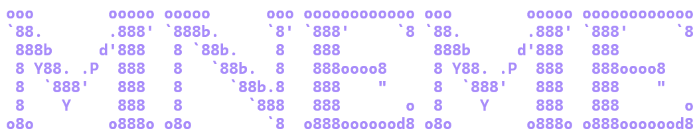

# Mneme

<p align="center">
  
</p>

> Named after Mnemosyne, the Greek goddess of memory — a local-document Retrieval-Augmented Generation system with a terminal UI.

[中文版](./README.zh.md)

Mneme indexes local documents and answers questions through an OpenAI-compatible LLM endpoint. It provides Standard RAG and Graph RAG modes, with a bilingual terminal UI and a Python CLI.

## Features

- **Hybrid retrieval** — Sentence-transformers + ChromaDB semantic search fused with BM25 keyword search using RRF (Reciprocal Rank Fusion).
- **Graph RAG** — LLM-extracted entity relationships expand retrieval for connected, cross-document questions.
- **Query decomposition** — Complex questions are split into sub-queries and retrieved concurrently.
- **Manifest-consistent indexing** — Canonical source IDs, content hashes, stable chunk IDs, atomic source replacement, exact deletion, and manifest versions keep the index synchronized with files.
- **Evidence-aware answers** — Query-local citations (`S1`, `S2`, ...), source paths, PDF pages, chunk IDs, and explicit untrusted-document boundaries.
- **Safe Graph RAG cache** — Graph caches use schema-validated JSON; no pickle loading path is used.
- **TUI and file watcher** — Streaming chat, slash commands, settings, file management, and debounced directory watching with serialized index mutations.
- **Endpoint and resource safeguards** — Remote endpoints default to HTTPS, retrieved snippets are bounded, and document size, PDF page count, and optional path-root limits are enforced.

## Supported file types

| Type | Extensions |
|------|-----------|
| PDF | `.pdf` |
| Word | `.docx` |
| Text and Markdown | `.txt`, `.md`, `.markdown`, `.log` |
| Web and data | `.html`, `.htm`, `.json`, `.csv`, `.xml`, `.yaml`, `.yml` |
| Configuration | `.toml`, `.cfg`, `.ini`, `.conf` |
| Source code | `.py`, `.js`, `.ts`, `.css`, `.sql`, `.sh`, `.bat` |

## Architecture

```
User question
  → query decomposition
  → concurrent hybrid retrieval / Graph RAG expansion
  → chunk deduplication and dynamic Top-K
  → PDF anchor enrichment
  → cited, bounded untrusted-document context
  → LLM answer + verifiable sources
```

| Mode | Retrieval | Best for |
|------|-----------|----------|
| **Standard RAG** | BM25 + ChromaDB + RRF fusion | General Q&A and broad document sets |
| **Graph RAG** | Standard RAG + entity graph expansion + alpha fusion | Connected or cross-document questions |

## Quick start

### Prerequisites

- Python 3.10 or newer
- An OpenAI-compatible API endpoint and API key (for example, DeepSeek or OpenAI)

### Install

```bash
git clone https://github.com/realhenrylan/mneme.git
cd mneme
python -m venv .venv
```

Activate the environment:

```powershell
# Windows PowerShell
.venv\Scripts\Activate.ps1
```

```bash
# macOS / Linux
source .venv/bin/activate
```

Install the package and development test dependencies:

```bash
python -m pip install -e ".[dev]"
```

### Configure

```bash
copy .env.example .env       # Windows PowerShell
# cp .env.example .env       # macOS / Linux
```

At minimum, set:

```dotenv
API_KEY=sk-your-api-key-here
BASE_URL=https://api.deepseek.com/v1
LLM_MODEL=deepseek-chat
```

On first launch, the onboarding wizard can collect and save the API settings. API keys are stored in `.env`; never commit that file or index secrets.

### Run the terminal UI

```bash
python -m tui
```

The UI supports Standard RAG and Graph RAG, file management, directory watching, settings, source display, and streaming answers.

### Run the CLI

Start an interactive Standard RAG session:

```bash
python -m src.rag --files /path/to/docs --collection my_docs
```

Start an interactive Graph RAG session:

```bash
python -m src.graph_rag --files /path/to/docs --collection my_docs --alpha 0.7
```

Use `--rebuild` when you intentionally want to rebuild the collection. Graph RAG also supports a single query:

```bash
python -m src.graph_rag \
  --files /path/to/docs \
  --query "What are the main findings?"
```

## TUI commands

| Command | Description |
|---------|-------------|
| `/help` | Show all commands |
| `/files` | Add, remove, list, watch, or stop watching files |
| `/mode` | Toggle Standard RAG / Graph RAG |
| `/alpha` | Set the Graph RAG fusion weight |
| `/settings` | View or change API settings |
| `/models` | List available models |
| `/status` | Show index and service status |
| `/clear` | Clear chat history |
| `/quit` | Exit |

Example file-watcher commands:

```text
/files watch /path/to/directory
/files list
/files stop
```

## Configuration

Copy `.env.example` as the starting point. The main settings are:

| Variable | Default | Description |
|----------|---------|-------------|
| `API_KEY` | — | OpenAI-compatible API key |
| `BASE_URL` | `https://api.openai.com/v1` | LLM endpoint; remote endpoints must use HTTPS |
| `LLM_MODEL` | `deepseek-chat` | Chat and query-decomposition model |
| `LLM_TEMPERATURE` | `0.2` | Generation temperature |
| `LLM_TOP_K_MIN` | `12` | Minimum retrieved chunks for standard retrieval |
| `LLM_TOP_K_MAX` | `70` | Maximum retrieved chunks for standard retrieval |
| `ALPHA` | `0.7` | Graph RAG semantic/graph fusion weight |
| `RAG_WATCH_DIR` | — | Directory watched by the TUI |
| `EMBEDDING_MODEL_PATH` | — | Local embedding model path; takes precedence |
| `EMBEDDING_MODEL_NAME` | `all-MiniLM-L6-v2` | Embedding model ID used for local/ModelScope loading |
| `MNEME_DOCUMENT_ROOT` | — | Optional root directory allowed for indexed files |
| `MNEME_MAX_DOCUMENT_BYTES` | `52428800` | Maximum document size, 50 MiB |
| `MNEME_MAX_PDF_PAGES` | `2000` | Maximum pages accepted from one PDF |
| `MNEME_MAX_REMOTE_CONTEXT_CHARS` | `60000` | Maximum retrieved context sent to an LLM endpoint |
| `MNEME_ALLOW_INSECURE_HTTP` | unset | Explicitly allow non-local HTTP endpoints; use only for controlled development |

Embedding models are first loaded from the configured local path or cache. If unavailable, Mneme uses the configured model identifier for ModelScope fallback; the default is `all-MiniLM-L6-v2`.

## Data and endpoint safety

Indexing and retrieval run locally, but retrieved document snippets are sent to the configured endpoint when Mneme performs query decomposition, Graph RAG entity extraction, or answer generation. Use a trusted endpoint and do not index API keys, passwords, or other secrets.

For non-local endpoints, HTTPS is required by default. Plain HTTP is allowed for loopback addresses such as `localhost`, `127.0.0.1`, and `::1`. A non-local HTTP endpoint requires the explicit `MNEME_ALLOW_INSECURE_HTTP=1` override.

Every answer context carries source and citation metadata inside an explicit untrusted-document boundary. The application treats retrieved text as data rather than instructions, and the context cap preserves complete source and boundary framing when text must be shortened.

## Project structure

```
mneme/
├── src/
│   ├── rag.py                    # Standard RAG pipeline and indexing
│   ├── graph_rag.py              # Graph RAG pipeline and JSON cache
│   ├── rag_query_decomposer.py   # Query decomposition
│   ├── citations.py              # Citation records and validation
│   ├── index_queue.py            # Serialized index mutations and snapshots
│   ├── metrics.py                # Bounded runtime metrics
│   ├── quality.py                # Retrieval quality metrics and gates
│   └── security.py               # Endpoint and document safety policy
├── tui/                          # Rich terminal UI and service layer
├── tests/                        # Unit, integration, and Phase A-D regressions
├── benchmarks/                  # Retrieval quality benchmark data
├── plans/                        # Design and assessment documents
└── .github/workflows/            # Windows/Linux CI
```

## Testing

Run the default offline-safe suite:

```bash
python -m pytest -q
python -m pip check
python -m compileall -q src tui tests
```

Tests that call a real external LLM are marked as integration tests and skipped by default. To run them intentionally:

```bash
MNEME_RUN_INTEGRATION=1 python -m pytest -m integration -q
```

## Changelog

See [CHANGELOG.md](./CHANGELOG.md).
