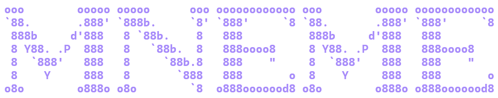

# Mneme

<p align="center">
  
</p>

> 以希腊记忆女神 Mnemosyne 命名 —— 一个面向本地文档、带终端 UI 的检索增强生成（RAG）系统。

[English](./README.md)

Mneme 为本地文档建立索引，并通过 OpenAI 兼容 API 回答问题。项目提供 Standard RAG 和 Graph RAG 两种模式，以及双语终端 UI 和 Python CLI。

## 特性

- **混合检索** — sentence-transformers + ChromaDB 语义检索，通过 RRF（倒数排名融合）与 BM25 关键词检索融合。
- **Graph RAG** — 使用大语言模型提取实体关系，扩展跨文档关联检索。
- **查询拆解** — 将复杂问题拆分为子查询并发执行。
- **Manifest 一致性索引** — 使用规范化 source ID、内容哈希、稳定 chunk ID、原子化来源替换、精确删除和 manifest 版本，保持索引与文件一致。
- **可核验回答** — 提供查询级引用（`S1`、`S2`……）、来源路径、PDF 页码、chunk ID 和明确的不可信文档边界。
- **安全 Graph RAG 缓存** — 图谱缓存使用带 schema 校验的 JSON，不加载 pickle。
- **TUI 与文件监控** — 支持流式聊天、斜杠命令、设置、文件管理、目录监控，以及串行化索引更新。
- **端点与资源保护** — 远程端点默认要求 HTTPS，并限制发送的上下文、文档大小、PDF 页数和可选路径根目录。

## P1.1 Minimal 诊断观测

生产观测默认**关闭**。Minimal 诊断观测必须由用户显式选择，仅在 `${MNEME_DATA_DIR}/traces/`（默认 `~/.mneme/traces/`）写入匿名化哈希字段与检索漏斗元数据。原始问题、历史、改写查询、子查询、模型响应和生成回答正文永不持久化。Exact replay 暂不提供。trace 默认保留 30 天，可使用 `delete-trace <id>`（或 TUI `/delete-trace`）删除；撤回同意会关闭观测并删除当前会话 trace。

**推送前自检（trace 数据绝不进远程）。** trace 文件与 `consent.json` 是 owner 个人本地数据，任何情况下不得被 stage/commit/push。推送前：

1. 运行 `git status`——确认没有 `traces/`、`consent.json`、`.mneme/` 类条目；
2. 确认观测保持**默认关闭**：不存在自动开启 consent 的代码路径，仓库内零真实 trace 数据；
3. 纵深防御：运行时守卫（`src/production_observability.py`）会在 traces root 落入工作树时 fail-closed 拒绝，`.gitignore` 也带有对应防御模式——但两者都不能替代上述人工检查。

## 支持的文件类型

| 类型 | 扩展名 |
|------|--------|
| PDF | `.pdf` |
| Word | `.docx` |
| 文本与 Markdown | `.txt`、`.md`、`.markdown`、`.log` |
| Web 与数据 | `.html`、`.htm`、`.json`、`.csv`、`.xml`、`.yaml`、`.yml` |
| 配置文件 | `.toml`、`.cfg`、`.ini`、`.conf` |
| 源代码 | `.py`、`.js`、`.ts`、`.css`、`.sql`、`.sh`、`.bat` |

## 架构

```
用户问题
  → 查询拆解
  → 并发混合检索 / Graph RAG 图谱扩展
  → chunk 去重与动态 Top-K
  → PDF 锚点增强
  → 带引用、长度受控的不可信文档上下文
  → 大语言模型回答 + 可核验来源
```

| 模式 | 检索方式 | 适用场景 |
|------|----------|----------|
| **Standard RAG** | BM25 + ChromaDB + RRF 融合 | 通用问答和大规模文档集 |
| **Graph RAG** | Standard RAG + 实体图谱扩展 + alpha 融合 | 关联性强、跨文档的问题 |

## 快速开始

### 方式 A：Docker（推荐）

前置条件：[Docker](https://docs.docker.com/get-docker/) 和 [Docker Compose](https://docs.docker.com/compose/install/)。

```bash
# 1. 克隆仓库
git clone https://github.com/realhenrylan/mneme.git
cd mneme

# 2. 配置环境变量
cp .env.example .env
# 编辑 .env — 至少设置 API_KEY 和 BASE_URL

# 3. 将文档放入 data 目录
mkdir -p data
cp /path/to/your/docs/* data/

# 4. 启动 TUI
docker compose up

# 或使用 CLI 模式：
docker compose run rag --files /data/xxx --collection my_docs
docker compose run graph-rag --files /data/xxx --collection my_docs --alpha 0.7
```

数据持久化：`./data`（文档）、`./chroma_db`（向量索引）和 `./models`（嵌入模型缓存）通过卷挂载，容器重启后数据不丢失。

### 方式 B：本地 Python

前置条件：

- Python 3.10 或更高版本
- 一个 OpenAI 兼容 API 端点和 API Key（例如 DeepSeek、OpenAI）

安装：

```bash
git clone https://github.com/realhenrylan/mneme.git
cd mneme
python -m venv .venv
```

激活虚拟环境：

```powershell
# Windows PowerShell
.venv\Scripts\Activate.ps1
```

```bash
# macOS / Linux
source .venv/bin/activate
```

安装项目和开发测试依赖：

```bash
python -m pip install -e ".[dev]"
```

### 配置

```powershell
copy .env.example .env       # Windows PowerShell
# cp .env.example .env       # macOS / Linux
```

至少设置以下配置：

```dotenv
API_KEY=sk-your-api-key-here
BASE_URL=https://api.deepseek.com/v1
LLM_MODEL=deepseek-chat
```

首次启动时，配置向导也可以收集并保存 API 设置。API Key 保存在 `.env` 中；不要提交该文件，也不要把密钥、密码等敏感文件加入索引。

### 启动终端 UI

```bash
mneme
```

UI 支持 Standard RAG、Graph RAG、文件管理、目录监控、设置、来源展示和流式回答。

### 启动 CLI

启动 Standard RAG 交互式会话：

```bash
python -m src.rag --files /path/to/docs --collection my_docs
```

启动 Graph RAG 交互式会话：

```bash
python -m src.graph_rag --files /path/to/docs --collection my_docs --alpha 0.7
```

只有在确实需要重建 collection 时才使用 `--rebuild`。Graph RAG 还支持单次查询：

```bash
python -m src.graph_rag \
  --files /path/to/docs \
  --query "主要结论是什么？"
```

## TUI 命令

| 命令 | 说明 |
|------|------|
| `/help` | 显示全部命令 |
| `/files` | 添加、删除、列出文件，启动或停止监控 |
| `/mode` | 切换 Standard RAG / Graph RAG |
| `/alpha` | 设置 Graph RAG 融合权重 |
| `/settings` | 查看或修改 API 设置 |
| `/models` | 列出可用模型 |
| `/status` | 显示索引和服务状态 |
| `/clear` | 清除聊天历史 |
| `/quit` | 退出 |

文件监控示例：

```text
/files watch /path/to/directory
/files list
/files stop
```

## 配置项

建议以 `.env.example` 为模板。主要配置如下：

| 变量 | 默认值 | 说明 |
|------|--------|------|
| `API_KEY` | — | OpenAI 兼容 API Key |
| `BASE_URL` | —（必填） | LLM 端点；**必填** gateway 配置，无内置默认值——仅设置 `API_KEY` 会在首次调用时以 `API_KEY or BASE_URL not configured` fail-fast；远程端点必须使用 HTTPS |
| `LLM_MODEL` | `deepseek-chat` | 回答和查询拆解使用的模型 |
| `LLM_TEMPERATURE` | `0.1` | 生成温度；允许范围 0.0–2.0 |
| `LLM_TOP_K_MIN` | `3` | TUI/流式路径使用的用户 Top-K 区间下界 |
| `LLM_TOP_K_MAX` | `20` | TUI/流式路径使用的用户 Top-K 区间上界 |
| `ALPHA` | `0.7` | Graph RAG 语义/图谱融合权重；允许范围 0.0–1.0 |
| `EMBEDDING_MODEL_PATH` | — | 本地 embedding 模型路径，优先于 `EMBEDDING_MODEL_NAME`；与其他受管路径一致，在进程启动时解析一次（`~` 展开、相对路径按启动目录绝对化），启动后 CWD 改变不会使 loader 参数漂移 |
| `EMBEDDING_MODEL_NAME` | `all-MiniLM-L6-v2` | 本地/ModelScope 加载使用的模型 ID |
| `MNEME_DATA_DIR` | `~/.mneme` | 数据目录：Chroma DB、BM25 快照、manifest 与模型自动下载缓存（`<目录>/models`）；`~` 在 Windows 下展开为 `%USERPROFILE%` |
| `MNEME_DOCUMENT_ROOT` | `./documents` | 允许建立索引的可选根目录；相对路径在进程启动时按启动目录解释（启动后不再随 CWD 漂移） |
| `MNEME_MAX_DOCUMENT_BYTES` | `52428800` | 单个文档大小上限，50 MiB；必须为正整数 |
| `MNEME_MAX_PDF_PAGES` | `2000` | 单个 PDF 页数上限；必须为正整数 |
| `MNEME_MAX_REMOTE_CONTEXT_CHARS` | `60000` | 发送到 LLM 端点的检索上下文上限 |
| `MNEME_ALLOW_INSECURE_HTTP` | 未设置 | 显式允许非本机 HTTP，仅建议受控开发环境使用 |
| `RAG_REFUSAL_THRESHOLD` | `0.03` | 检索拒答阈值；必须 ≥ 0 |
| `RAG_RERANKER` | `none` | Reranker 模式：`none` 或 `cross-encoder` |
| `RAG_RERANKER_MODEL` | `cross-encoder/ms-marco-MiniLM-L-6-v2` | `RAG_RERANKER=cross-encoder` 时使用的 reranker 模型 |
| `MNEME_OFFLINE` | 未设置 | 离线模式。精确承诺：**仅禁止隐式远程 ModelScope 下载**；本地模型照常加载、LLM API 调用不受影响。本地模型缺失时给出明确的纯本地错误。 |
| `RAG_WATCH_DIR` | — | TUI 监控目录 |

配置优先级：**真实环境变量 > `.env` > 内置默认值**。`.env` 在进程启动时从启动目录（当前工作目录，即命令所在目录）读取，且早于任何 Settings 构造——CLI、TUI、RAG 一致生效；真实环境变量始终优先。若进程环境中已存在 `API_KEY` 与 `BASE_URL`，TUI 不会进入首次引导，即使没有 `.env`。TUI/onboarding 保存配置后经 `reset_settings()` 刷新：设置界面只持久化到 `.env`，绝不覆盖进程环境变量；进程值继续生效，`.env` 修改须在没有该进程覆盖的重启后生效。所有数值与范围在启动时校验：非法数值或矛盾范围会带配置名直接失败（fail-fast），发生在任何索引构建、模型加载、网络访问或目录写入之前。路径支持 `~` 展开（Windows 下展开为 `%USERPROFILE%`），相对路径按进程启动目录解释。

用户 Top-K 区间（`LLM_TOP_K_MIN`/`LLM_TOP_K_MAX`，默认 3–20，TUI/流式路径使用）与同步路径使用的内部检索宽度（`retrieve` 宽度 70、动态 Top-K 边界 12–70）是两个独立概念；内部检索宽度不提供环境变量覆盖。Graph RAG 的内部动态 Top-K 截断同样固定为 3–50（`GRAPH_DYNAMIC_MIN_K`/`GRAPH_DYNAMIC_MAX_K`），不与用户 Top-K 3–20 区间绑定。

Embedding 模型会优先从配置的本地路径或缓存加载；不可用时，ModelScope 回退使用用户配置的模型标识，默认是 `all-MiniLM-L6-v2`（`MNEME_OFFLINE=1` 时禁用该回退），自动下载缓存到 `<MNEME_DATA_DIR>/models`。

## 数据与端点安全

索引和检索在本地执行，但在查询拆解、Graph RAG 实体抽取或回答生成时，检索到的文档片段会发送到配置的 API 端点。请使用可信端点，不要索引 API Key、密码或其他敏感信息。

非本机端点默认要求 HTTPS。`localhost`、`127.0.0.1` 和 `::1` 等回环地址允许使用 HTTP。非本机 HTTP 必须显式设置 `MNEME_ALLOW_INSECURE_HTTP=1`。

每个回答上下文都在明确的不可信文档边界中携带来源和引用信息。系统把检索文本当作数据而不是指令；当上下文需要缩短时，会保留完整的来源标注和边界框架。

## 项目结构

```
mneme/
├── src/
│   ├── rag.py                    # Standard RAG 流程与索引
│   ├── graph_rag.py              # Graph RAG 流程与 JSON 缓存
│   ├── rag_query_decomposer.py   # 查询拆解
│   ├── citations.py              # 引用记录与校验
│   ├── index_queue.py            # 串行索引更新与快照
│   ├── metrics.py                # 有界运行指标
│   ├── quality.py                # 检索质量指标与门禁
│   └── security.py               # 端点和文档安全策略
├── tui/                          # Rich 终端 UI 和服务层
├── tests/                        # 单元、集成和 Phase A-D 回归测试
├── benchmarks/                  # 检索质量基准数据
├── plans/                        # 设计和评估文档
└── .github/workflows/            # Windows/Linux CI
```

## 测试

运行默认的离线安全测试套件：

```bash
python -m pytest -q
python -m pip check
python -m compileall -q src tui tests
```

真实外部 LLM 测试标记为 integration，默认跳过。确认 API 配置和费用后再显式运行：

```bash
MNEME_RUN_INTEGRATION=1 python -m pytest -m integration -q
```

## 变更记录

参见 [CHANGELOG.md](./CHANGELOG.md)。
