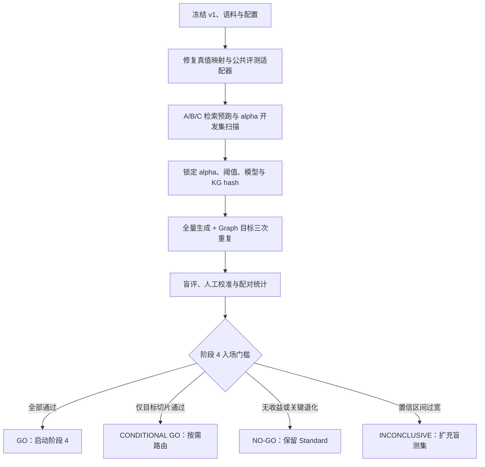

# Mneme Graph RAG 阶段 4 入场评测方案

> 版本：1.0  
> 日期：2026-08-02  
> 状态：方案已设计，正式对比评测尚未运行  
> 决策对象：是否启动阶段 4，而不是证明 Graph RAG 必然优于 Standard RAG

## 技术摘要

- 本评测采用**同题、同索引、同查询规划、同重排、同上下文预算、同生成模型**的配对实验，主对比为 `Standard + Reranker + Graph` 相对 `Standard + Reranker` 的边际收益。
- 现有 110 条 v1 数据可用于首轮方向判断，但其中 Graph 主要目标切片只有 24 条，当前 13 条 holdout 中仅 3 条属于该切片。若置信区间不能排除零收益，结论必须是“证据不足”，不能据此启动阶段 4。
- 正式运行前必须修复评测可比性：现有 Standard 与 Graph 回答链路不等价；检索 runner 会把相关来源的所有 chunk 当作相关；12 条可回答样本缺少 chunk 真值；多轮 runner 未按会话回放历史；生成 runner 未调用当前生产回答接口。
- 阶段 4 的入场条件同时约束质量、退化风险和在线成本。建议核心门槛为：Graph 目标切片的答案要点覆盖率至少提升 5 个百分点，配对 95% 置信区间下界大于 0；实际 prompt 的 context recall 至少提升 5 个百分点；总体正确性、拒答、引用和忠实度不越过退化门槛；在线检索前处理 p95 增量不超过 1.5 秒且不超过 2 倍。
- 若 Graph 仅对跨文档或困难问题有收益，应进入阶段 4，但产品形态应是**条件路由**，不应默认对所有查询开启 Graph。

## 1. 本次评测要回答的决策问题

核心问题不是“Graph 能否召回一些额外 chunk”，而是：

> 在 Mneme 当前 Standard RAG 能力之上，Graph 通道是否能以可接受的延迟、Token、稳定性和安全成本，显著改善目标查询的最终回答质量？

评测产生三种合法结论：

| 结论 | 含义 | 后续动作 |
| --- | --- | --- |
| `GO` | Graph 达到质量增益、非退化和成本门槛 | 启动阶段 4，优先实现确定性 schema、分数标定、增量缓存与安全边界 |
| `CONDITIONAL GO` | Graph 只在预注册切片显著获益 | 启动阶段 4，但仅做查询路由后的按需 Graph，不设为默认模式 |
| `NO-GO / INCONCLUSIVE` | 无净收益、出现关键退化，或样本不足以形成可信结论 | 保留 Standard RAG；修复数据或扩充盲测集后再决定，不进行 Graph 产品化 |

## 2. 现有证据与评测集边界

### 2.1 v1 数据集覆盖

数据源为 `evaluation/datasets/v1.jsonl`，当前自动校验通过，共 110 条、6 个来源文件。

| 查询类型 | 数量 | 中文 | 英文 | 混合 | Easy | Medium | Hard | 可回答但无 chunk 真值 |
| --- | ---: | ---: | ---: | ---: | ---: | ---: | ---: | ---: |
| 单事实 `single_fact` | 35 | 20 | 14 | 1 | 23 | 11 | 1 | 0 |
| 跨文档 `cross_document` | 13 | 3 | 4 | 6 | 0 | 6 | 7 | 1 |
| 元数据 `metadata` | 16 | 5 | 11 | 0 | 11 | 2 | 3 | 11 |
| 多轮 `multi_turn` | 10 | 5 | 5 | 0 | 3 | 5 | 2 | 0 |
| 无答案 `no_answer` | 25 | 13 | 12 | 0 | 24 | 1 | 0 | 0 |
| 混合意图 `mixed_intent` | 11 | 0 | 0 | 11 | 2 | 9 | 0 | 0 |
| **合计** | **110** | **46** | **46** | **18** | **63** | **34** | **13** | **12** |

其他已确认边界：

- 可回答查询 85 条，应拒答查询 25 条。
- 当前 `split_dataset(..., holdout_ratio=0.12, seed=42)` 产生 97 条开发集和 13 条 holdout。
- holdout 仅包含 2 条跨文档和 1 条混合意图查询，无法单独支撑“Graph 显著获益”的强结论。
- 数据集只有 6 个来源文件，适合质量基线，不足以代表 1k/10k chunk 的规模性能。

### 2.2 正式运行前的五个阻断项

以下问题不修复时，结果只能作为诊断，不能作为阶段 4 入场证据。

1. **两条回答链路不等价。** `src.rag.answer_query()` 包含 history-aware rewrite、query decomposition、原查询保底召回、reranker、来源多样性、Parent-Child/邻接扩展和引用修复；`src.cli_loop._graph_rag_answer()` 当前不具备同一组步骤。直接比较会把“Graph”与其他链路差异混在一起。
2. **chunk 真值被扩大。** `evaluation.runner.RetrievalRunner.run_case()` 当前会将相关来源内的所有 chunk 加入 `relevant_chunk_ids`，而不是只匹配标注片段，导致 chunk Recall/nDCG 被系统性高估。
3. **12 条可回答样本无 chunk 真值。** 这类样本可计算 source recall 和答案质量，但在补标前不得进入 chunk recall、context precision/recall、citation recall 的分母。
4. **多轮没有真实回放。** v1 使用 `follow_up_to` 表示会话链，但现有 runner 按独立 query 执行，没有向检索和生成传递共享历史。
5. **现有生成 runner 不对应当前生产接口。** `evaluation.generation_runner` 试图以 `answer_query(query, context)` 调用当前需要模型、collection、BM25、documents 和 metadatas 的接口；其 heuristic faithfulness 主要检查答案要点是否出现在 context 中，并未验证生成答案中的陈述是否被证据支持。

## 3. 预注册假设与评测切片

### 3.1 假设

| 编号 | 假设 | 判定指标 |
| --- | --- | --- |
| H1 | Graph 对跨文档和混合意图查询有可测的答案质量增益 | 答案要点覆盖率、盲评正确性、context recall |
| H2 | Graph 的增益不是由更多上下文或更大 Token 预算换来的 | 相同 context budget 下的质量、context precision、prompt tokens |
| H3 | Graph 不损害普通事实、多轮和拒答能力 | 总体正确性、multi-turn、false-answer/false-refusal、引用指标 |
| H4 | Graph 的增益超过单独增加 reranker 的收益 | `C-B` 与 `B-A` 的配对差值 |
| H5 | Graph 的在线和建库成本在可接受范围内 | 分阶段 p50/p95、TTFT、Token、错误率、建图成本 |

### 3.2 固定切片

正式看结果前固定以下切片，禁止根据结果临时删除失败样本：

| 切片 | 样本 | 用途 |
| --- | ---: | --- |
| Graph 目标切片 | `cross_document` 13 + `mixed_intent` 11 = 24 | 阶段 4 的首要质量判定 |
| 全部可回答 | 85 | 总体非退化门槛 |
| 无答案 | 25 | 拒答与虚构风险门槛 |
| 多轮 | 10 | history rewrite 与链式退化检查，不作为 Graph 主收益切片 |
| 困难 | 13 | 高难查询诊断 |
| 语言 | zh 46 / en 46 / mixed 18 | 多语言退化检查 |

可额外增加 `graph_applicable` 人工标签，但必须在隐藏模式输出、未查看 A/B 结果前由两名标注者独立完成。该标签只能作为次要解释切片，不能替代预注册的 24 条主切片。

## 4. 实验组设计：先测边际收益，再看当前产品表现

### 4.1 主要受控实验

| 组 | Pipeline | 目的 |
| --- | --- | --- |
| A — Standard | 当前 Standard 检索链路，reranker 关闭 | 生产默认基线 |
| B — Standard + Reranker | A + 固定 reranker | 判断简单重排能否获得同等收益 |
| C — Standard + Reranker + Graph | B + Graph 候选通道与融合 | **阶段 4 主判定组；主效应为 C-B** |

若部署环境明确不使用 reranker，可增加 `D — Standard + Graph` 作为部署诊断，但不能用 `D-A` 代替主效应 `C-B`，除非 A 与 D 的其他步骤完全相同。

### 4.2 当前模式观察实验

另外保留一组“as-is”对比：直接调用当前 Standard CLI/TUI 路径和当前 Graph CLI/TUI 路径。这组结果代表现有用户体验，但由于 pipeline 不等价，只能用于发现产品回归，不能证明 Graph 算法本身有效。

### 4.3 可比性约束

受控实验中，A/B/C 必须满足：

- 使用相同的源文件、解析结果、chunk ID、Chroma collection 和 BM25 snapshot。
- 使用相同 embedding、query rewrite、query decomposition 和原查询保底召回结果；这些 LLM 输出应按 query 和版本缓存，避免两臂随机漂移。
- 使用相同 reranker 模型、候选上限、来源多样性规则、Parent-Child/邻接扩展、context token/字符预算和引用映射。
- 使用相同回答 prompt、LLM 模型版本、temperature、max tokens、timeout 和 retry 策略。
- C 组唯一允许的质量变量是 Graph 候选/分数；Graph 查询实体抽取结果需缓存并记录版本。
- 拒答阈值在整个对比中冻结，不允许针对某一组单独调节。
- Graph 建图完成后冻结 KG 快照并记录 SHA-256；正式 query 对比期间不得重建。

### 4.4 Graph 分数与 alpha 敏感性

当前 Graph 使用 `(1-alpha)/(rank+1)`，而 Standard 的 RRF 分数约为 `1/(rank+60)` 量级，原始分数不能直接做有意义的 alpha 比较。

因此分两条轨运行：

1. **现状轨**：保留当前实现和默认 `alpha=0.7`，只做风险诊断。
2. **价值验证轨**：在评测适配器中将语义/词法和 Graph 都转换为同量纲 rank score，再做 alpha 扫描。该适配器只用于验证潜在收益，不视为阶段 4 产品实现。

开发集扫描 `alpha ∈ {1.0, 0.9, 0.8, 0.7, 0.6, 0.5}`，其中 `1.0` 是无 Graph 的同路径控制。选择规则按以下顺序执行：

1. 最大化 Graph 目标切片的 context recall；
2. 候选相差不超过 1 个百分点时，选择更高 alpha，即更弱的 Graph 权重；
3. context precision 相对 B 组下降超过 2 个百分点的候选直接淘汰；
4. alpha 锁定后再运行 holdout，不得回调。

## 5. 真值、上下文和多轮回放

### 5.1 chunk 真值映射

正式 runner 应生成版本化的 `ground_truth_map.json`：

```text
case_id
  -> source_id
  -> normalized snippet
  -> matched chunk_id(s)
  -> match_method
  -> reviewer_status
```

匹配优先级：

1. 规范化后的 snippet 完整包含；
2. 同 source/page/section 内的 token overlap 或字符相似度；
3. Parent chunk 与 child chunk 的结构映射；
4. 无唯一匹配时进入人工复核，不得自动把整个 source 标为 relevant。

12 条缺少 chunk 真值的可回答样本应优先补标。若某些元数据问题确实不存在内容 chunk 真值，需标记 `relevance_level=source`，并从 chunk/context/citation recall 的分母中排除，但仍进入 source recall 和答案评测。

### 5.2 区分三个检索层级

- **Candidate retrieval**：融合和重排前后召回的候选，计算 Recall@5/10/20、MRR、nDCG。
- **Selected context**：实际进入 prompt 的 chunk，计算 context recall、context precision、来源覆盖和 token 数。
- **Cited evidence**：答案真正引用的证据，计算 citation validity、citation precision/recall 和 claim support。

不得用 dynamic Top-K 的候选数代替实际 prompt 中的 evidence 数。

### 5.3 多轮回放

多轮评测分两层：

1. **固定历史层**：使用预先审核的 canonical prior answer，A/B/C 获得完全相同的历史，用于隔离检索方法差异。
2. **端到端层**：每组使用自己上一轮生成的答案继续对话，用于测量误差累积。

主判定采用固定历史层；端到端层作为稳定性与产品风险指标。会话链必须整体分配到 development 或 holdout，不能把同一会话的不同 turn 拆到两边。

## 6. 指标体系

### 6.1 质量指标

| 层级 | 主指标 | 补充指标 | 统计分母 |
| --- | --- | --- | --- |
| 候选检索 | Recall@5/10/20、nDCG@10、MRR | source recall@5/10、Graph lift/pollution rate | 有对应 chunk/source 真值的可回答 query |
| Prompt 上下文 | context recall、context precision | context source coverage、context token/字符数 | 实际进入 prompt 的证据 |
| 回答 | 答案要点覆盖率 | 0-4 正确性、完整性、简洁性 | 可回答 query；按 case 宏平均 |
| 引用 | citation ID validity | citation precision/recall、claim-citation support | 生成了答案或引用的 query |
| 拒答 | false-answer rate、false-refusal rate | precision、recall、F1 | 25 条无答案 + 85 条可回答 |
| 多轮 | follow-up answer point coverage | rewrite success、会话末轮正确性 | 3 条完整会话链 |

关键定义：

- `Graph lift rate`：B 未将至少一个 relevant chunk 放入实际 context，而 C 成功放入的 case 占比。
- `Graph pollution rate`：Graph-only 非相关 chunk 进入 context，并挤出 B 中 relevant chunk 的 case 占比。
- `答案要点覆盖率`：回答中被正确表达且与 evidence 一致的 acceptable answer points / 全部 answer points。
- `claim-citation support`：带引用的可验证 claim 中，被所引证据直接支持的比例。

当前 `compute_faithfulness()` 不应作为最终忠实度主指标；它应改名为 context support heuristic，正式忠实度由 claim-evidence 判定补充。

### 6.2 性能、成本和稳定性指标

| 维度 | 指标 |
| --- | --- |
| 建库 | Standard index time、Graph build time、每 1k chunk 时间、实体抽取 Token、失败/重试数、KG nodes/edges |
| 在线检索 | rewrite、decompose、embedding、dense、BM25、Graph entity extraction、graph traversal、fusion、rerank、context build 的 p50/p95 |
| 生成 | TTFT、LLM latency、total latency 的 p50/p95 |
| 成本 | 每 query prompt/completion/total tokens；Graph 增量 tokens；按配置价格计算的估算成本 |
| 资源 | 峰值 RSS、索引大小、KG cache 大小 |
| 稳定性 | API error rate、retry rate、timeout rate、3 次重复运行的 top-10 overlap 和答案分数方差 |

规模性能至少分两层报告：当前 6 文件真实语料用于端到端质量；1k/10k chunk 语料用于吞吐和资源曲线。若没有代表性规模语料，可先报告当前规模结果，但不得外推 10k chunk 的性能。

### 6.3 Graph 安全与外发指标

- 建图和 query entity extraction 实际外发的 chunk/query 数、字符数和 Token 数。
- 外发 endpoint、model、timeout、retry 和数据保留假设。
- 敏感信息扫描命中数、阻断数、漏检抽样结果。
- 间接 prompt injection、引用伪造和 canary 数据外泄用例的成功攻击率。

安全项在阶段 4 入场时可作为风险说明，但在 Graph 对用户开放前必须成为硬门禁。

## 7. 生成质量判定与盲评

### 7.1 自动判定

- 数值、名称和枚举类 answer points 使用规范化 exact/regex 判定。
- 语义类 answer points 使用固定版本 judge 模型逐点判定 `covered / contradicted / unsupported / missing`。
- judge 只接收 query、reference points、evidence 和随机化后的 Answer X/Y，不接收模式名、alpha、分数或延迟。
- judge temperature 设为 0；保存完整 prompt、model version、原始响应和解析结果。

### 7.2 人工校准

- Graph 目标切片 24 条全部进行人工盲评。
- 其他切片按语言、类型、难度分层抽取至少 20%。
- 两名标注者独立判断；报告 Cohen's kappa 或 Krippendorff's alpha，目标不低于 0.70。
- 不一致样本由第三人裁决，并保留原始分歧。
- Answer X/Y 顺序对每个 case 随机化，以控制位置偏差。

## 8. 统计方法与重复策略

- 所有主比较均为同一 case 的配对比较，报告绝对差值和相对差值。
- 主指标采用 case-level paired bootstrap，10,000 次重采样，固定 seed=42，报告 95% 置信区间。
- 多轮 case 按 conversation block 重采样，避免把同一会话 turn 当作独立样本。
- 拒答和其他二元成败指标使用 McNemar exact test，并同时报告实际变化的 case 数。
- 延迟和 Token 使用中位数、p95 与配对中位数差，不用均值代替尾延迟。
- 主假设只检验 `C-B` 的 Graph 目标切片答案要点覆盖率和 context recall；语言、难度等切片属于诊断，避免多重比较制造“显著”结果。
- 检索在冻结索引/KG 上运行 3 次确认排序稳定；生成全量运行 1 次，并对 Graph 目标、multi-turn 和 hard 三个切片补足到 3 次。API 失败样本按 intent-to-treat 计入，不能静默丢弃。

## 9. 阶段 4 入场门槛

### 9.1 `GO` 的全部必要条件

| 维度 | 硬门槛 |
| --- | --- |
| 目标回答质量 | C-B 在 24 条 Graph 目标切片的答案要点覆盖率绝对提升 **≥ 5pp**，且 paired bootstrap 95% CI 下界 **> 0** |
| 目标上下文 | C-B 的 context recall 绝对提升 **≥ 5pp**；context precision 下降不超过 2pp |
| 超过简单方案 | C 的目标回答质量高于 B；若 B-A 已取得同等或更高收益，则 Graph 不入场 |
| 总体非退化 | 85 条可回答查询的答案要点覆盖率下降不超过 2pp；任何语言切片下降不超过 5pp |
| 拒答 | 相对 B 最多新增 1 条 false answer，且 false-refusal 不增加超过 1 条 |
| 引用与忠实 | citation ID validity = 100%；claim-citation support 与正确性均不下降超过 2pp |
| 在线延迟 | Graph 额外的生成前处理 p95 同时满足：增量 ≤ 1.5s 且 C/B ≤ 2.0；total p95 增长 ≤ 20% |
| Token 成本 | 每 query total tokens 增长 ≤ 30%，且绝对增量 ≤ 800 tokens；两者取更严格者 |
| 运行完整性 | 目标切片完成率 100%；全量 API/runner failure rate ≤ 1%，所有失败均计入结果 |

若产品已有更严格 SLO，应以产品 SLO 覆盖本方案中的建议成本门槛。

### 9.2 `CONDITIONAL GO`

当总体不适合默认开启，但预注册的 `cross_document` 或 `graph_applicable` 切片单独满足上述质量和非退化门槛时，可启动阶段 4，但必须同时交付轻量级查询路由器：

```text
普通事实 / 元数据 / 无答案风险高 -> Standard
明确跨实体、跨文档、多跳关系       -> Graph
路由置信度不足                    -> Standard
```

### 9.3 必须判为 `NO-GO / INCONCLUSIVE` 的情况

- 主指标平均提升不足 5pp，或 95% CI 包含 0。
- Graph 只提升 source recall，却没有改善实际 context 或最终答案。
- 单独 reranker 已获得相同收益，Graph 没有额外边际价值。
- 收益依赖更大 context、不同 prompt、不同回答模型或更宽松拒答阈值。
- 关键退化、失败或成本门槛未通过。
- 目标切片真值未完成或样本量不足。

`INCONCLUSIVE` 不等于失败。如果 v1 的 24 条目标样本出现正向点估计但置信区间过宽，应先新增至少 30 条盲标 Graph 目标用例，再用锁定配置做一次独立确认；不得继续在 v1 上反复调参直到显著。

## 10. 阶段 4 完成后的上线门槛

进入阶段 4 只代表值得投资，不代表可以立即对用户开放。上线前还需满足：

- 相同语料和配置重复建图，canonical entities、edges 和 KG hash 完全一致。
- exact entity 无边时可稳定回退到 `entity_to_chunks`；别名与规范化匹配有独立回归集。
- Graph 和 Standard 分数同量纲，锁定 alpha 在独立 holdout 上仍通过质量门槛。
- 来源增删改只重新抽取受影响 chunk，缓存命中和失效逻辑通过测试。
- 建图外发前有用户确认、敏感信息扫描和 Standard-only 模式。
- prompt injection 与 canary 外泄测试不弱于 Standard；citation repair 覆盖 Graph 路径。

## 11. 推荐执行顺序



建议拆成五个可审计步骤：

1. **P0 — 评测预检**：冻结 dataset/corpus hash，补齐 chunk 真值和 canonical multi-turn history，修复公共 runner。
2. **P1 — 检索实验**：运行 A/B/C，完成 alpha 开发集扫描、Graph lift/pollution 分析和失败样本列表。
3. **P2 — 生成实验**：锁定全部参数后生成答案，进行自动 judge 和人工盲评。
4. **P3 — 统计与决策**：输出配对差值、置信区间、成本和 guardrail，对照门槛给出唯一结论。
5. **P4 — 独立确认**：若 v1 结果正向但证据不足，新增盲测集并只运行一次锁定配置。

## 12. 建议新增的评测入口与产物

以下是建议实现的 CLI 契约，**当前仓库尚无 `evaluation.compare` 入口**：

```powershell
# 1. 数据与语料预检
python -m evaluation.compare --dataset evaluation/datasets/v1.jsonl --corpus-dir test_texts --validate-only

# 2. 开发集检索与 alpha 扫描
python -m evaluation.compare --phase retrieval --split development --arms standard standard-rerank graph-rerank --alpha-grid 1.0 0.9 0.8 0.7 0.6 0.5 --seed 42 --output results/graph-gate/dev

# 3. 锁定配置后的完整生成评测
python -m evaluation.compare --phase generation --split all --arms standard standard-rerank graph-rerank --config results/graph-gate/locked-config.json --repeats-target 3 --seed 42 --output results/graph-gate/final

# 4. 独立 holdout，只允许使用已锁定配置
python -m evaluation.compare --phase full --split holdout --config results/graph-gate/locked-config.json --output results/graph-gate/holdout
```

每次运行保存：

| 文件 | 内容 |
| --- | --- |
| `run-manifest.json` | git commit、dirty state、dataset/corpus SHA-256、模型版本、prompt 版本、配置、seed、KG hash、环境信息 |
| `ground-truth-map.json` | 标注片段到 chunk ID 的版本化映射与审核状态 |
| `retrieval-cases.jsonl` | 每个 case、每组的 candidates、scores、context、阶段延迟和指标 |
| `generation-cases.jsonl` | answer、citations、tokens、errors、judge 和人工标签 |
| `summary.json` | overall、固定切片、配对 delta、CI 和门槛结果 |
| `failures.csv` | 所有 win/loss/flip、污染、拒答错误、API 失败和人工备注 |
| `decision-report.md` | 面向阶段 4 的最终 GO / CONDITIONAL GO / NO-GO 结论 |
| `locked-config.json` | holdout 运行唯一允许的 alpha、阈值、模型、prompt 和 graph 版本 |

## 13. 最终决策报告模板

最终报告必须先给结论，再给证据，至少包含：

1. `GO / CONDITIONAL GO / NO-GO / INCONCLUSIVE`。
2. A/B/C 在 Graph 目标切片和总体的答案要点覆盖率、context recall/precision、citation、拒答、p95 延迟和 Token。
3. `C-B` 的配对差值与 95% CI，以及 `B-A` 的对照结果。
4. Graph lift、Graph pollution、改善/退化 case 清单。
5. 中文、英文、混合、跨文档、多轮、无答案和 hard 切片。
6. 当前 Graph 路径与受控实验路径的差异说明。
7. 数据缺口、judge 一致性、API 失败、模型和语料外推限制。
8. 若入场，明确默认开启还是条件路由，以及阶段 4 首个实现项。

## 14. 限制与待确认项

- 目前没有产品级延迟与单 query 成本 SLO，本方案给出的是工程建议门槛；正式评测前应由产品所有者确认是否更严格。
- v1 的 Graph 目标切片较小，显著性不足时必须扩充盲测集，不能用全量 110 条的平均值稀释目标问题。
- 现有语料只有 6 个来源，Graph 在真实大知识库中的连接密度、噪音和建图成本仍需规模实验。
- LLM judge 只能降低人工成本，不能取代目标切片的人工盲评。
- 本方案不预设 Graph 应当胜出；`NO-GO` 是有效且可能更经济的工程结论。

## 15. 推荐的立即下一步

先实现 P0，而不是直接发起昂贵的生成评测：

1. 新建共享的 `evaluation.compare`/adapter，使 A/B/C 只差 Graph 和显式配置的 reranker。
2. 生成并人工审核 `ground-truth-map.json`，补齐 12 条缺失 chunk 真值。
3. 为多轮链补充 canonical history，并做 group-aware split。
4. 修复生成 runner，使其调用与生产一致的 query orchestration，而不是自行拼装一条简化链路。
5. 预跑 10 条 smoke cases；确认引用映射、Token、分阶段 latency、错误计数和结果落盘后，再运行全量 110 条。

完成 P0 后，才具备一次性运行正式对比、并让结果能够真正决定阶段 4 去留的条件。
